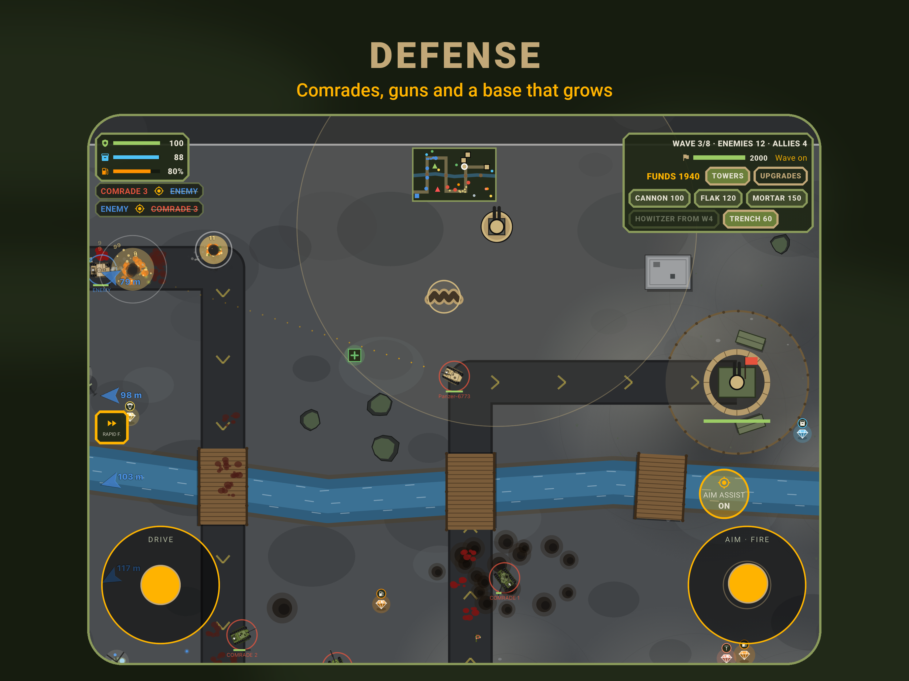
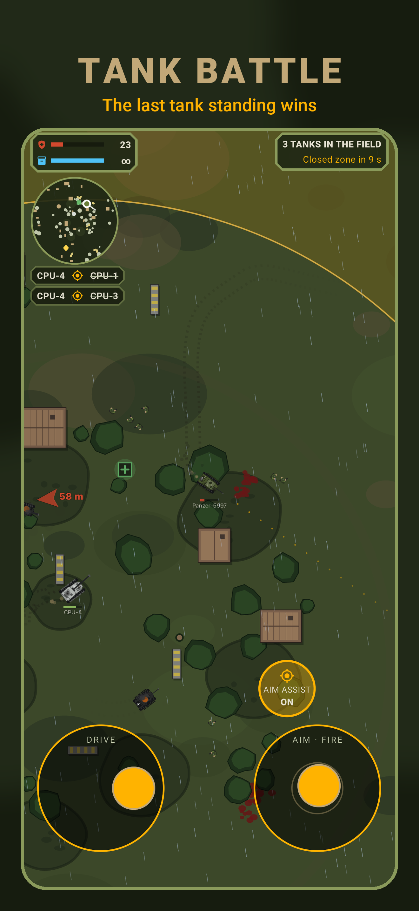
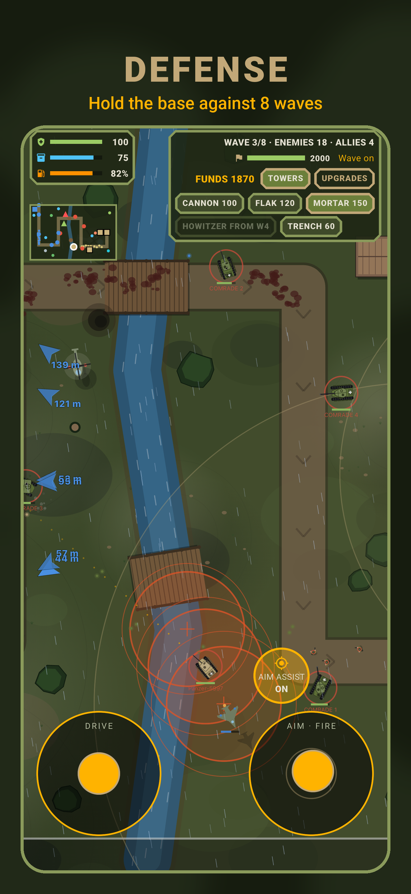
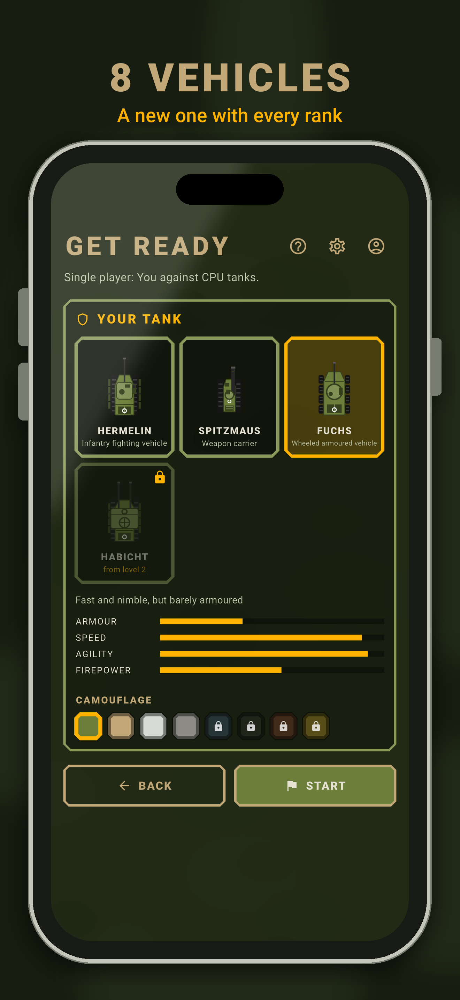
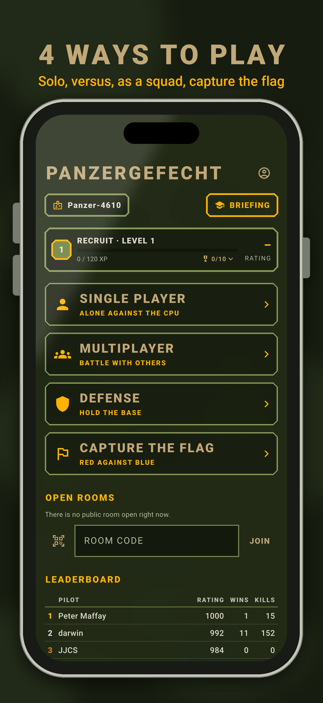

# Panzergefecht

A 2D tank battle in olive drab: last tank standing against CPU tanks or
other people, or together against waves of enemy tanks in a tower defense
mode, or red against blue in capture the flag. In German and English,
without ads.

**[▶ Play in the browser](https://www.regetskcob.de/wargame/)** · iOS and
Android apps · Mac · Apple TV · Apple Watch (in progress)

<p align="center">
  
</p>

<p align="center">
  
  
  
  
</p>

<sub>Screenshots in German: [store/ios/screenshots/de-DE](store/ios/screenshots/de-DE).</sub>

## Ways to play

- **Single player:** alone against 1 to 4 CPU tanks on three levels.
- **Multiplayer:** free for all or red against blue, in private rooms (link,
  code or QR code) or public ones from the room list. Late joiners watch.
- **Defense:** together against 8 waves of tanks, helicopters, jets and
  drones. Build guns, upgrade the tank, watch the base grow from a
  watchtower to a citadel, and extend into endless waves.
- **Capture the flag:** red against blue, steal the other side's flag and
  bring it home, with CPU tanks filling both sides.
- **Two on one screen:** split screen on the Apple TV, a tablet (iPad or
  Android), a Mac or in the browser with two controllers or phones, and a **duel** of two bases
  against each other.

## Highlights

- Eight vehicles from Spitzmaus to Wolf, unlocked by rank,
  each with its own armour, speed and gun.
- Four grounds with changing weather, day and night, destructible buildings
  and soldiers on foot that fight.
- Crates and gems: repair, smoke, shield, mines, artillery, a mortar, a
  kamikaze drone, paratroopers, an air strike.
- Fuel stations and ammo depots to stop at, that blow up when shot; in
  capture the flag each side guards its own.
- Ranks, an Elo rating, badges, a leaderboard by points for rounds, wins,
  kills, accuracy and rating, replays and a rematch button.
- Keyboard and mouse, touch sticks with aim assist, game controllers, the
  Siri Remote, or a phone as a controller for the big screen.
- An iOS widget with the pilots online and a Live Activity for the running
  round.
- No game server: the netcode runs entirely on Supabase Realtime.

All features with their numbers (damage tables, defense thresholds) are in
[docs/gameplay.md](docs/gameplay.md).

## How it is built

| Layer | What we use |
| --- | --- |
| Game and UI | [Flutter](https://flutter.dev) 3.47 with [Flame](https://flame-engine.org) 2.0, Material 3 in an olive drab theme |
| Netcode | [Supabase Realtime](https://supabase.com/docs/guides/realtime): one Broadcast channel per room, Presence for lobby, host role and room list |
| Data and accounts | Supabase Postgres with row level security, Supabase Auth (guests, e-mail), typed access through `supabase_flutter` 3.0.0-dev.9 and `supabase_typegen` 0.5.1 |
| Hosting | GitHub Pages, built by GitHub Actions on every push to `main` |

A round is just `{seed, startedAt}`: every client builds the same world from
the seed, and only events go over the network. Each client simulates its own
tank and the victim of a hit applies the damage itself, so there is no game
server to run. Rated results go through one database function,
`record_round`. More in [docs/netcode.md](docs/netcode.md).

The typed database layer is the Supabase v3 groundwork, merged into
[supabase-flutter](https://github.com/supabase/supabase-flutter) and
published to pub.dev ([#1634](https://github.com/supabase/supabase-flutter/pull/1634)
typed tables, [#1635](https://github.com/supabase/supabase-flutter/pull/1635)
the code generator). Everything resolves from pub.dev, no git dependencies
and no `dependency_overrides`.

## Getting started

You need [Flutter](https://flutter.dev) 3.47 or newer; for a local backend
also the [Supabase CLI](https://supabase.com/docs/guides/local-development)
2.x and Docker.

```sh
flutter pub get
flutter run -d chrome
```

The game talks to the hosted Supabase project by default (see
`lib/src/app/env.dart`). Run it twice to play against yourself; players with
the same `ROOM` meet in the same arena. To use a local stack instead:

```sh
supabase start   # API on port 54621, applies the migrations
flutter run -d chrome \
  --dart-define=SUPABASE_URL=http://127.0.0.1:54621 \
  --dart-define=SUPABASE_KEY=sb_publishable_... \
  --dart-define=ROOM=dev
```

## Project structure

| Path | Contents |
| --- | --- |
| `lib/src/game` | The Flame game (`TankGame`), its rules, config and bots; `tank_game/` holds its methods by topic, `components/` the tanks, shells and terrain, `defense/` the defense mode |
| `lib/src/net` | Realtime rooms, events and payloads |
| `lib/src/db` | Supabase services and the generated schema |
| `lib/src/ui` | Overlays, widgets, tutorial and theme |
| `lib/src/app`, `audio`, `l10n`, `legal` | App shell and environment, sound, German and English texts, legal pages |
| `lib/src/watch`, `lib/src/tv` | Apple Watch screens, Apple TV controls and two players on one screen |
| `test` | Unit and widget tests, mirroring `lib/src` |
| `android`, `ios`, `macos`, `web`, `watchos`, `tvos` | Platform runners |
| `store` | App Store and Google Play texts, icons and screenshots |
| `supabase` | Migrations, config and mail templates |

## Documentation

- [Gameplay in detail](docs/gameplay.md): every feature, damage tables,
  defense thresholds.
- [Platforms](docs/platforms.md): iOS and Android apps, the Mac, Apple
  Watch, Apple TV and two players on one screen.
- [Netcode and Realtime limits](docs/netcode.md): events, authority, rooms,
  and what fits which Supabase plan.
- [Development](docs/development.md): tests, regenerating the typed models,
  deploying.

## Roadmap

**Next**

- GitHub and Google logins: create the OAuth apps and switch the providers
  on in Supabase. The game shows their buttons on its own.
- The Apple Watch version on a real watch (crown sensitivity, text sizes),
  with the tutorial and sign-in.
- Wear OS: the watch screens, crown steering, the round layout and the Wear
  OS bundle are ready; next the form factor in the Play Console and a real
  watch.
- Replays for defense rounds, and replays to share through Supabase Storage.
- Trust in the room channels: every message names its sender itself, so a
  player can still pose as another. Fix with private channels and Realtime
  Authorization that bind a presence to its account, and a server-side
  owner per room.
- Round results checked on the server through an Edge Function instead of
  trusting what each client reports. Until then numbers are only clamped.
- More tests (about 20 % of the code is not covered): the defense rules as a
  pure function with an injected clock, `record_round` and the policies with
  pgTAP in CI, widget and golden tests for HUD, shop, lobby and leaderboards,
  coverage in CI with a floor.

**Ideas**

- Defense: difficulty levels and a leaderboard for the extension.
- Single player missions: escort, hold the position, take the flag.
- Capture the flag and king of the hill for multiplayer.
- Loadouts that unlock with experience, such as ammunition types.
- Seasons and weekly challenges on top of `round_results`.
- Friends, clans and shared replays.
- Key bindings, colour blindness settings, and the web version as a PWA.
